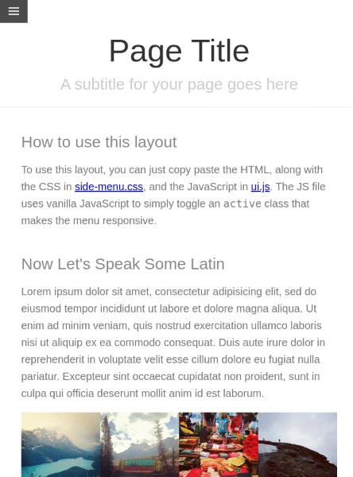

# Pure.css Responsive Side Menu using CSS only

[Responsive Sidemenu Example](https://purecss.io/layouts/side-menu/) of [purecss](https://purecss.io) without JavaScript.

The folder `original-example-with-js` contains the original Code from `Pure.css`. The adapted code, without using JavaScript is located in the `without-js` folder.

  

